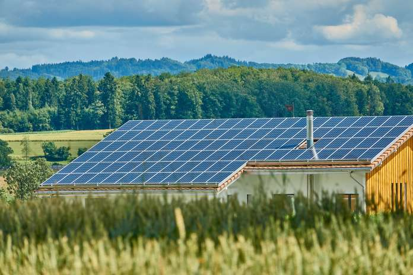

## mlzoomcamp-capstone-project
This is a capstone project of [ML Engineering Zoomcamp by DataTalks](https://github.com/DataTalksClub/machine-learning-zoomcamp) - Cohort 2023

**Estonian Dairy Farm with solar panels installed on the roof [(Image source)](https://ceenergynews.com/innovation/eesti-energia-to-install-smart-solar-park-for-the-estonia-dairy-farm/)**

# Energy Production by Solar Panels Prosumers in Estonia
### Who are prosumers? 
Those kinds of customers of electricity providers that both consume and produce energy are called **prosumers**.  
The term is a portmanteau of the words producer and consumer. Here a single prosumer is an entity that produces energy specifically by solar panels. 

### Unit of the analysis
In this analysis we model and predict the amount of electricity produced by Estonian energy customers who have installed solar panels.  
The unit of the analysis is **the group of prosumers that share the same**:
- **location**: are located in the same district- **Läänemaa**,
- **legal status**: are businesses.

### Target
- We predict **the amount of energy** that will be produced by the group of all solar panels prosumers in the Läänemaa district **in the next hour**.

### Why is the accurate prediction of energy consumption and production important?
The number of prosumers in Estonia (and many other countries) has recently increased causing problems of **energy imbalance**.  
This could lead to higher operational costs, potential grid instability, and inefficient use of energy resources. And simply energy can be wasted in the area where in a given time period many prosumers produced more energy than expected.  
Current predictions are very inefficient. Improving them would significantly:
- **reduce the imbalance costs**,
- **improve the reliability of the grid** and
- **make the integration of prosumers into the energy system more efficient and sustainable**. 

Accurate predictions of energy production and use is needed if we want to promote renewable energy and **incentivize more customers to become prosumers** showing them that their energy will be managed well.

### Weather 
Weather greatly influences the production of energy by solar panels so a weather data is our main source of features for the model.

### Data
Data is based on data from Kaggle competition: [Enefit - Predict Energy Behavior of Prosumers](https://www.kaggle.com/competitions/predict-energy-behavior-of-prosumers). 
To decrease the size of the dataset we limit the data to only **one district in Estonia**.
The chosen district is mapped to **number 6** which is **Läänemaa**, located in western Estonia and borders the Baltic Sea to the north and west. 
    

Fields in data.csv:
- **target** - The production amount for the hour.
- **temperature** - The air temperature at 2 meters above ground in degrees Celsius at a time of prediction.
- **dewpoint** - The dew point temperature at 2 meters above ground in degrees Celsius at a time of prediction.
- **cloudcover_[low/mid/high/total]** - The percentage of the sky covered by clouds in the following altitude bands: 0-2 km, 2-6, 6+, and total at a time of prediction.
- **10_metre_[u/v]_wind_component** - The [eastward/northward] component of wind speed measured 10 meters above surface in meters per second at a time of prediction.
- **direct_solar_radiation** - The direct solar radiation reaching the surface on a plane perpendicular to the direction of the Sun accumulated during the preceding hour, in watt-hours per square meter at a time of prediction.
- **surface_solar_radiation_downwards** - The solar radiation, both direct and diffuse, that reaches a horizontal plane at the surface of the Earth, in watt-hours per square meter at a time of prediction.
- **snowfall** - Snowfall over the previous hour in units of meters of water equivalent at a time of prediction.
- **total_precipitation** - The accumulated liquid, comprising rain and snow that falls on Earth's surface over the preceding hour, in units of meters at a time of prediction.

### Model

#### Neural Network with Keras
We train a neural network using Keras from Tensorflow library.

